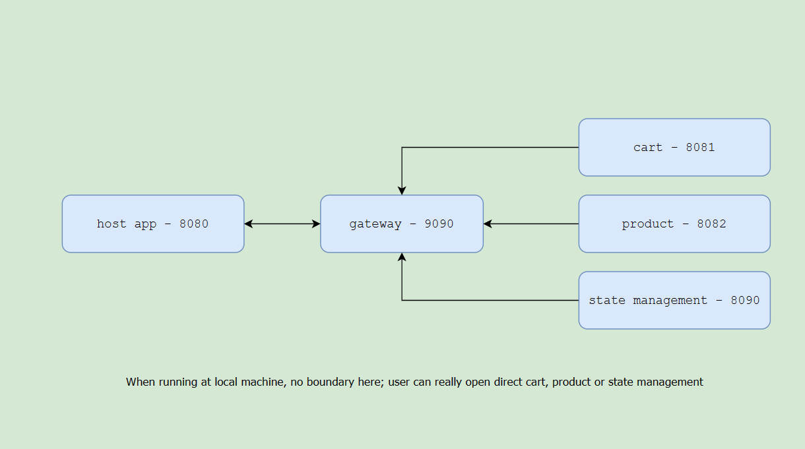
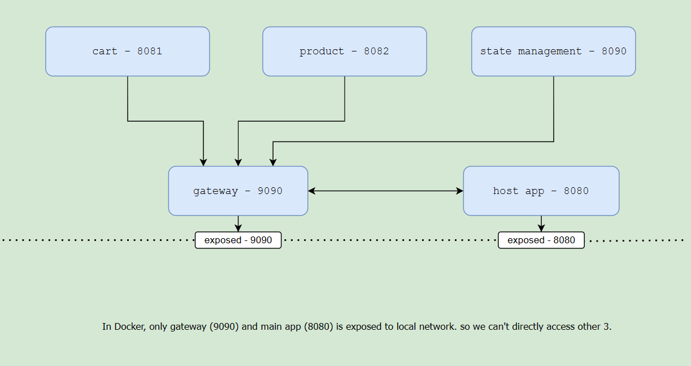

# Micro Frontend React App 
A demo app showing how truely microfrontend app is created. To see the real world scenario, run via docker, and see how we have hidden the internal lib/package (cart, product) behind gateway/proxy.
## Important NMP packages -
1. React
1. Redux (https://redux-toolkit.js.org/)
1. Webpack + babel
1. Typescript
1. fast-gateway
1. Lerna
1. Docker ( optional )

### To Run locally -
1. pull the code to your machine.
1. go the root directory where you have `lerna.json` file, and run `npm install`.  This will not juse install the `node_modules` at root, but also for child packages - `api-gateway, cart, products, state-management and host` (*this may take some time, installing for all childs*)
1. at same directory level run `npm start` which will start all child and will launch the host in default browser http://localhost:8080
### To Under Docker
1. pull the code to your machine.
1. go the root directory where you have `lerna.json` file, and run `docker compose up -d`
1. once all services are up and started, open https://localhost:8080.

This monorepo has 5 components/packages which works together to make a product listing and cart functionality.
1. `state-management` runs on `8090`
    * this is all about handling the state in redux for all, being as component, it can easily manage the state of all the other component, we have expose a function `addReducer` which other component are using to register the `reduce` in global store.
1. `cart` runs on `8081`
    * this is component has small cart functionlity and cart component, which is exposed and avilable to be used by `host` app. This component use the `state-management` (via `gateway`) to register cart related redux slice, and let `state-management` handle redux state at global store. 
1. `product` runs on `8082`
    * 3rd component in stack, which is responsible for product fetching and listing. it also use the `state-management` (via `gateway`) to store the list of product to store. This also expose component which has product listing, `host` app will this component to list the product in final page.
1. `api-gateway` runs on `9090`
    * this one is used to hide the above 3 behind gateway. so on real production server, there will not be any direct access to ports - `8090`, `8081` & `8082`, in fact `9090` will be considered as single point, and nobody knows how many micro frontends are running behind this gateway.
1. `host` runs on `8080`
    * this is final product, which use all above components to get the final product.

## Good to know - 
* when running on local machine using `npm run` from root, we are using `lerna`(https://lerna.js.org/) to start all these components parallel. and launching browser for `localhost:8080`  (`host` app only).
* `host` app will use the exposed components from `cart`, `product` and `state-management` via `gateway` and will render full page.
* when running on local machine, all ports are accessible, though host app is using those via `gateway`
* when running via docker (`docker compose up -d` from root directory) only `gateway` port `9090` and `host` app port `8080` are expose, not internal parts - `cart, product & state-management`

## When running on local machine.

## When running under docker.

#react #redux #TypeScript #Javascript #docker #microfrontend #cart #create-mf-app #create-react-app #cra
